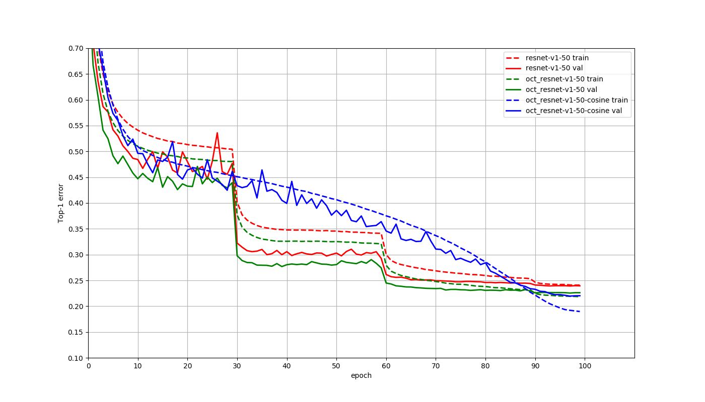

# OctaveConv
A MXNet Implementation for Drop an Octave

## 笔记

#### Q：为什么高频信号不应该是要减去低频信号才可以得到的吗  

A：因为实际上OctConv希望能在降低计算量的同时提升效果，高低频通路如果大小一样的话，其实低频卷积上为了大的感受野还是要用很大的卷积核，因此直接在小图上卷积

#### Q: 为什么先做了卷积才分频，这不是真正的分频    

A：OctConv实际上没有真正意义上做分频这件事
  - OctConv的低频map实际上是pooling得到的，没有恢复原来的大小，因此频率应该实际上没有变低
  - 其实比起分频段卷积，OctConv更像是“同时维护原始map和pooling后的map”，这样的操作。也就是说，在原来的基础上维护一条pooling后的通路，并且在每次卷积的时候进行数据交换，  
  - 仅此而已，所谓分频只是一种思想，一种类比，实际上并没有完全做到的。

## 原始介绍
This repository contains a [MXNet](https://github.com/apache/incubator-mxnet) implementation of the paper [Drop an Octave: Reducing Spatial Redundancy in Convolutional Neural Networks with Octave Convolution](https://arxiv.org/abs/1904.05049). 

| Model                  |  Top1  |
| :--------------------- | :----: |
| ResNet-v1-50           |  76.05 |
| OctResNet-v1-50        |  77.47 |
| OctResNet-v1-50-cosine |  78.04 |

OctResNet-v1-50-cosine model used alpha = 0.25 in the table 2 of the paper. 

## To Do List
- [ ] support mobilenet v1/v2

## Acknowledgment
This repo is based on [DPN](https://github.com/cypw/DPNs). 

## UPDATE 
Here is the official implementation: https://github.com/facebookresearch/OctConv (Highly Recommend!)
